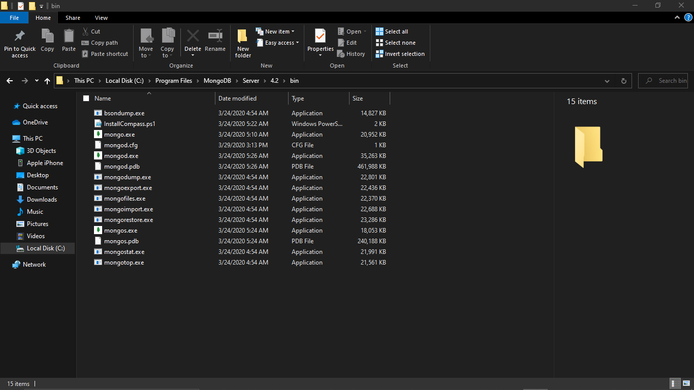
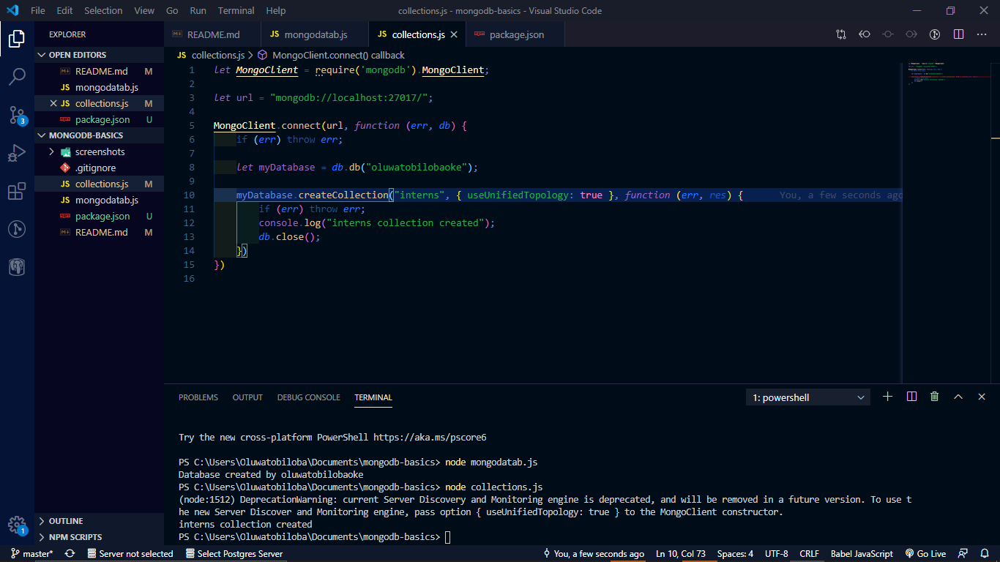
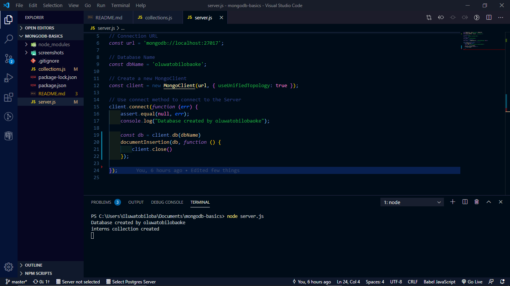

Welcome to my Mongodb basics ReadMe file

git clone https://github.com/Oluwatobilobaoke/mongodb-basics.git

npm install
run node server.js

Mongo and Mongod .exe terminals at the bin directory in your mongodb file

Database created by Oluwatobilobaoke

Interns Collections created by Oluwatobilobaoke

Interns Collections created by Oluwatobilobaoke
